# High risk high reward? Maybe
## Comparative analysis: SAFE_MODE on vs off (2021 test set)

## Intro

We evaluate two approaches on the same assignment-compliant setup:

- train: 2018-01-01 to 2020-12-31
- test: 2021-01-01 to 2021-12-31
- training strategy: `one_time`

The two approaches are:

1. **First approach (SAFE_MODE = True)**: conservative profile focused on capital protection
2. **Second approach (SAFE_MODE = False)**: aggressive profile focused on trend capture and higher return

---

## 1) First approach: are results coherent with the aim of the approach

### Aim of approach 1
We aim for lower risk, smoother equity, and controlled drawdowns, while staying profitable.

### Results
- Accuracy: **0.5326**
- Macro F1: **0.5326**
- Final Equity: **1.4047**
- CAGR: **40.47%**
- Volatility: **28.51%**
- Max Drawdown: **-23.65%**
- Avg Holding: **6.93 bars**
- Buy&Hold Final Equity: **1.5968**

Confusion matrix:

| True \\ Pred | -1 | +1 |
|---|---:|---:|
| -1 | 2322 | 1874 |
| +1 | 2220 | 2344 |

### Coherence check
Yes, results are coherent with the conservative objective:

- the model has a modest but real edge (accuracy/F1 above 0.53)
- strategy is profitable in absolute terms (`FinalEquity > 1`)
- volatility and drawdown are much lower than benchmark
- return is lower than buy-and-hold, which is expected for a defensive profile

### Safe visuals
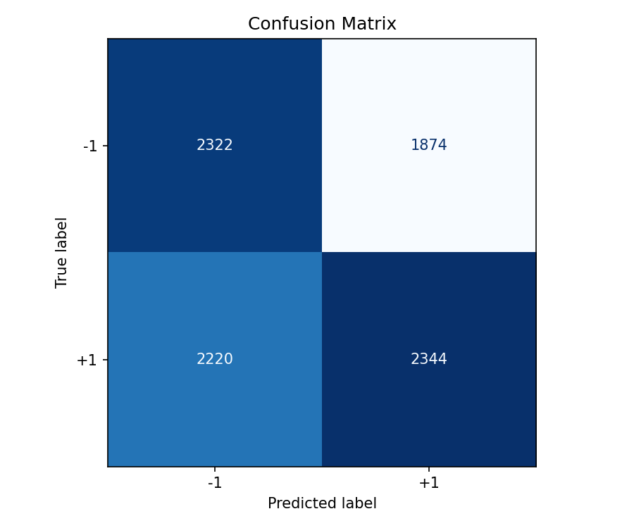  
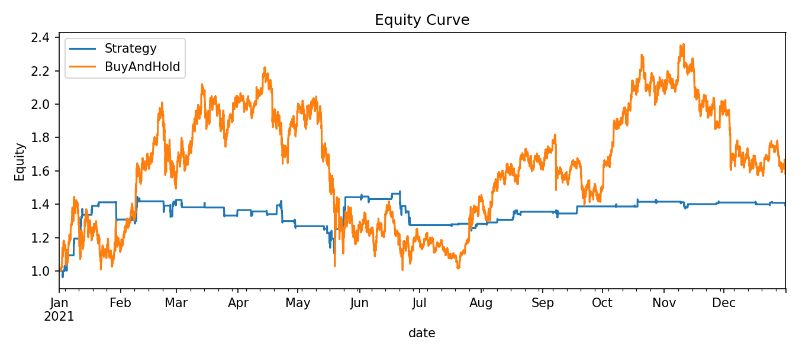  
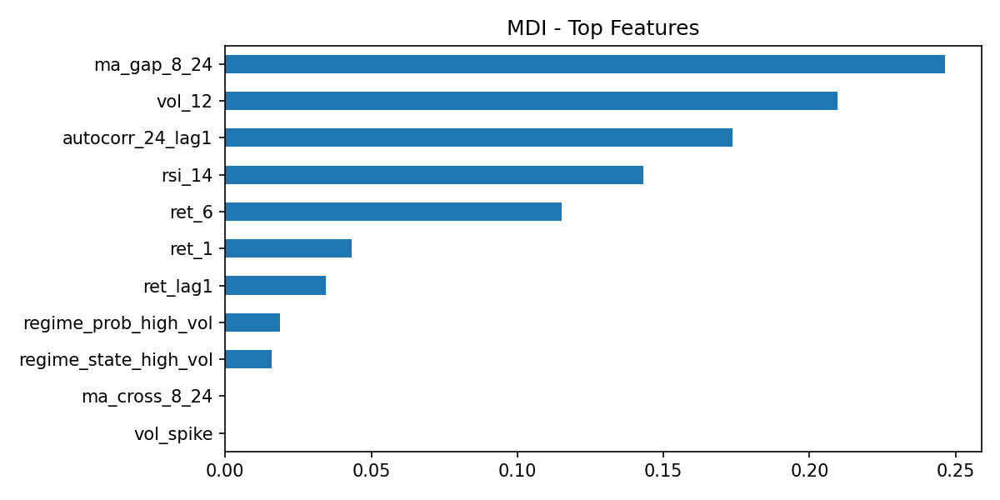  
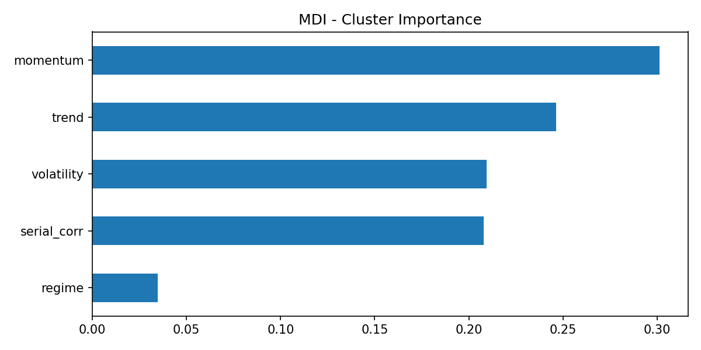  
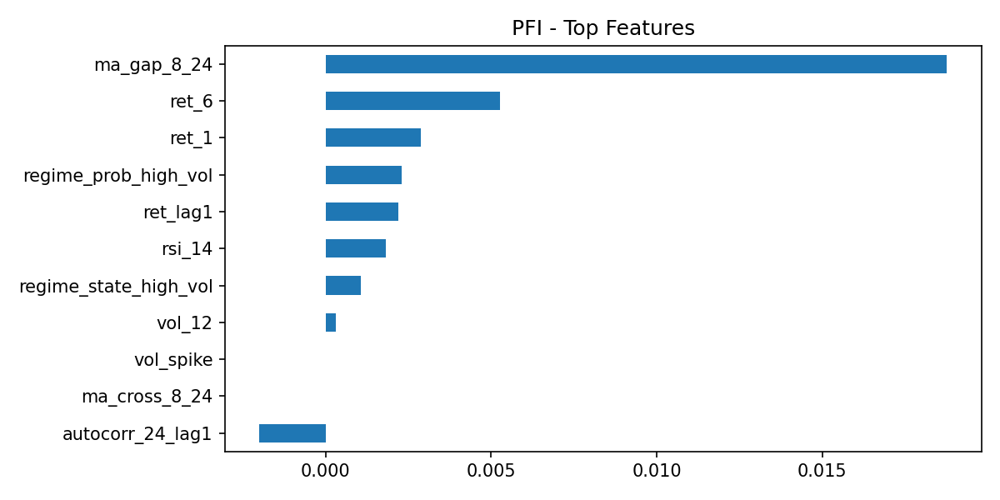  
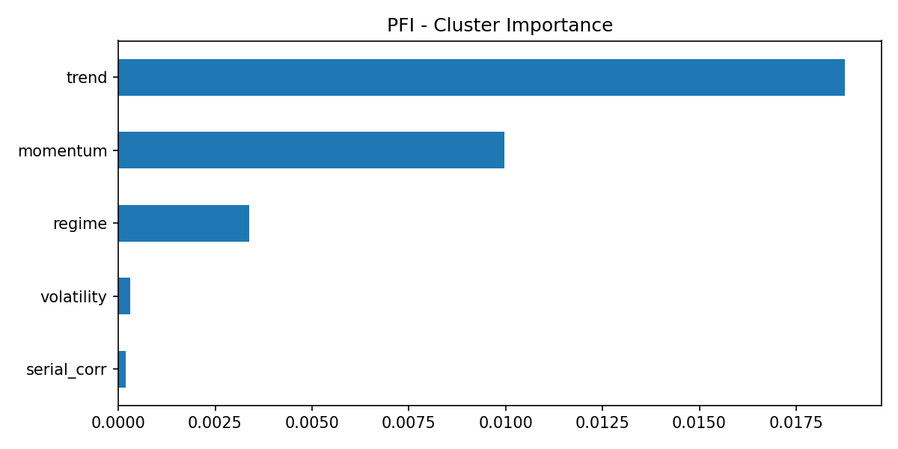

---

## 2) Second approach: are results coherent with the second approach

### Aim of approach 2
We aim to capture more upside trends and improve total return, accepting higher risk.

### Results
- Accuracy: **0.5364**
- Macro F1: **0.5364**
- Final Equity: **1.6826**
- CAGR: **68.26%**
- Volatility: **90.28%**
- Sharpe: **1.032**
- Sortino: **1.264**
- Max Drawdown: **-50.23%**
- Avg Holding: **39.21 bars**
- Buy&Hold Final Equity: **1.5968**

Confusion matrix:

| True \\ Pred | -1 | +1 |
|---|---:|---:|
| -1 | 2383 | 1813 |
| +1 | 2248 | 2316 |

### Coherence check
Yes, results are coherent with the aggressive objective:

- classification improves slightly vs safe mode
- strategy captures more trend and beats buy-and-hold on final equity
- volatility and drawdown increase significantly, consistent with higher-risk behavior
- longer holding period matches stronger trend participation

### Aggressive visuals
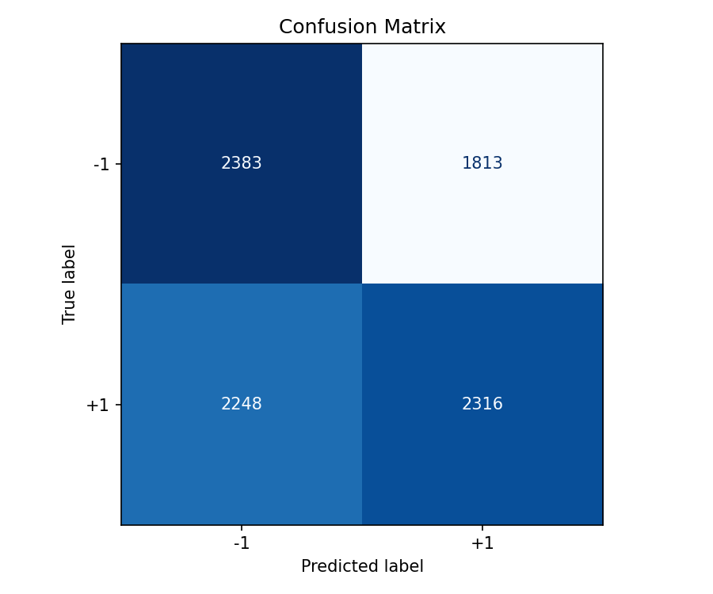  
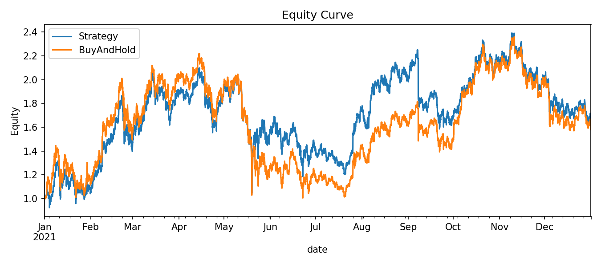  
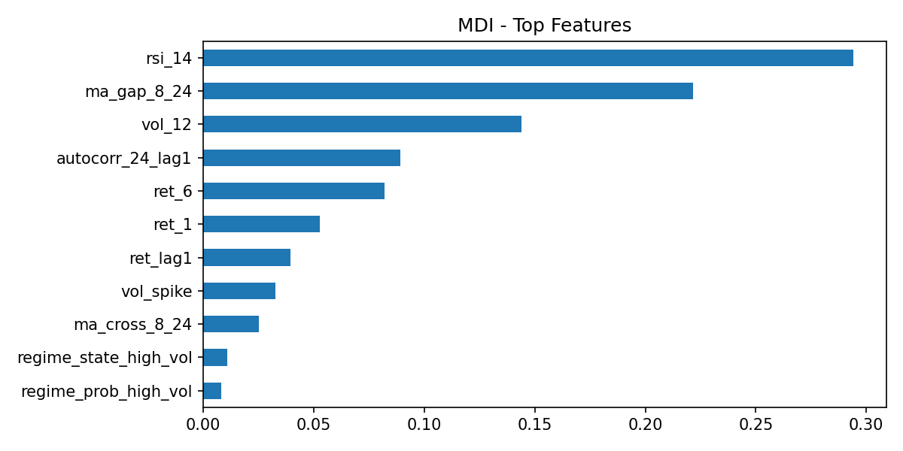  
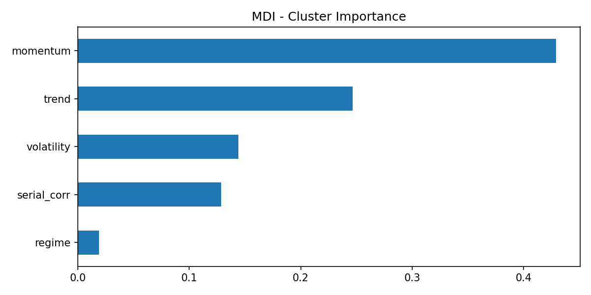  
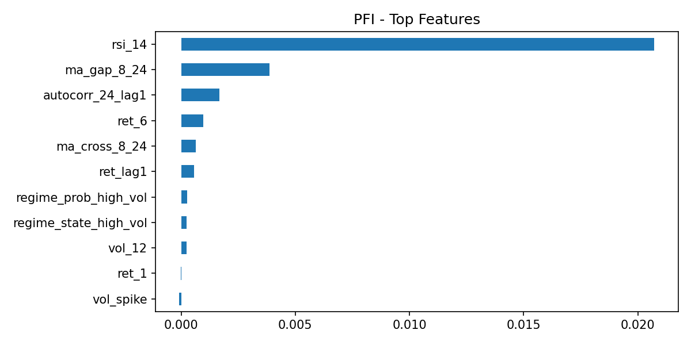  
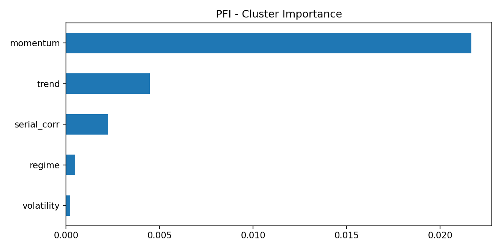

---

## Conclusion

Both approaches are internally coherent with their design goals.

- **SAFE_MODE = True** is coherent as a defensive approach: lower risk and smaller drawdowns, but lower upside.
- **SAFE_MODE = False** is coherent as an aggressive approach: higher return and benchmark outperformance in this run, with much higher risk.

So the title answer is:

- safe mode: not really high-risk/high-reward
- aggressive mode: yes, mostly high-risk/high-reward