# Comparative Analysis of Strategy Configurations (2021 Test Set)

## Intro

In this report, we compare four strategy setups built on the same ML pipeline:

1. SAFE + short allowed  
2. SAFE + short not allowed  
3. Aggressive + short allowed  
4. Aggressive + short not allowed

We keep the same core train/test framework and only change profile + short policy.  
This lets us isolate where performance differences come from.

---

## Terms we use

- **Accuracy / Precision / Recall / F1 (macro):** classification quality metrics.
- **Confusion matrix:** true vs predicted class counts.
- **Final Equity:** ending value of 1.0 initial capital.
- **CAGR:** annualized compounded return.
- **Volatility:** annualized return standard deviation.
- **Sharpe / Sortino:** return-adjusted risk metrics.
- **Max Drawdown:** worst peak-to-trough loss.
- **MDI/PFI:** feature importance from model structure / permutation test.

---

# 1) SAFE profile

## 1.1 SAFE + short allowed

### Classification
- Accuracy: **0.5306**
- Macro F1: **0.5303**
- Confusion matrix:
  - True -1: 2217 / 1979
  - True +1: 2133 / 2431

### Backtest
- Final Equity: **0.9604**
- CAGR: **-0.0396**
- Volatility: **0.8205**
- Sharpe: **0.3669**
- Max Drawdown: **-0.6098**

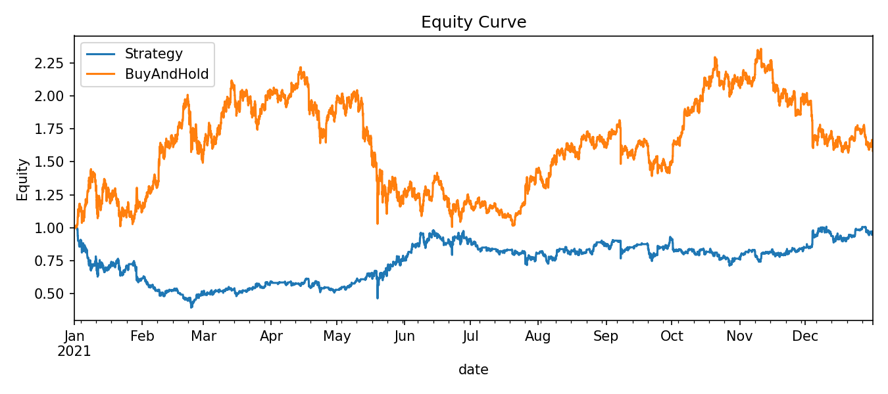

### Feature importance
- MDI leader: `vol_12`
- PFI leader: `ret_6`
- Cluster leaders: momentum and serial-correlation families

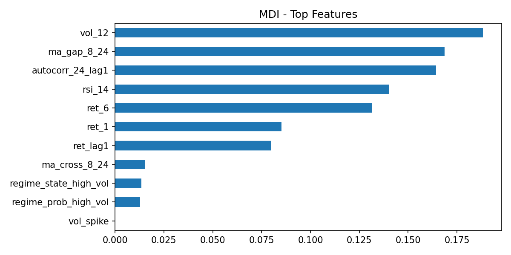

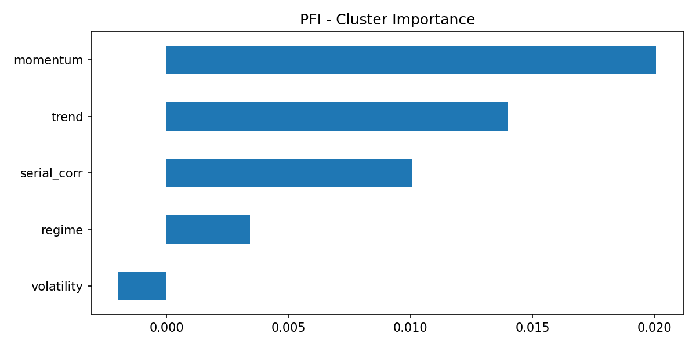

---

## 1.2 SAFE + short not allowed

### Classification
Same classifier quality as SAFE short-allowed run.

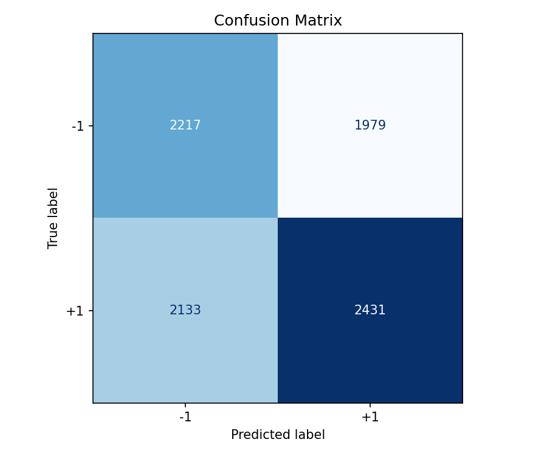

### Backtest
- Final Equity: **1.1533**
- CAGR: **0.1533**
- Volatility: **0.1285**
- Sharpe: **1.1744**
- Max Drawdown: **-0.1325**

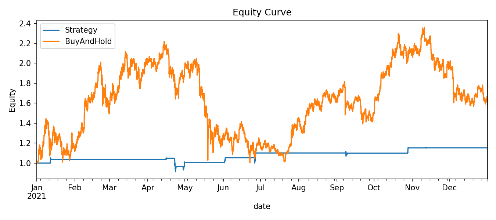

### Feature importance
Same SAFE model-family pattern (`vol_12` and momentum/trend features remain central).

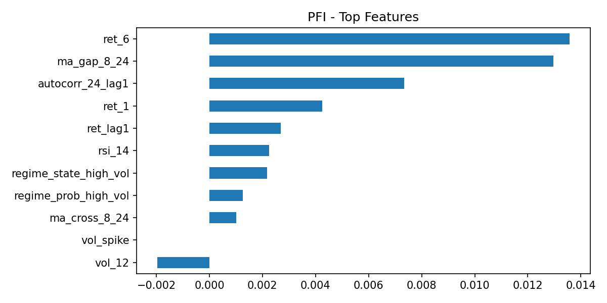
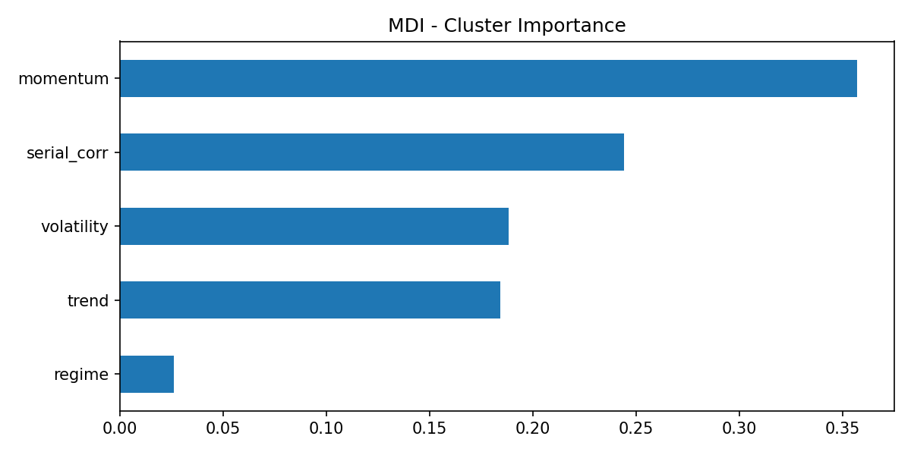

---

## 1.3 SAFE comparison

When we disable shorting in SAFE mode, results improve a lot on this dataset:
- better Final Equity
- much lower drawdown
- much lower volatility

Interpretation: with a modest classifier edge (~53%), short exposure in SAFE mode added more harm than benefit in 2021.

---

# 2) Aggressive profile

## 2.1 Aggressive + short allowed

### Classification
- Accuracy: **0.5309**
- Macro F1: **0.5308**
- Confusion matrix:
  - True -1: 2411 / 1785
  - True +1: 2324 / 2240

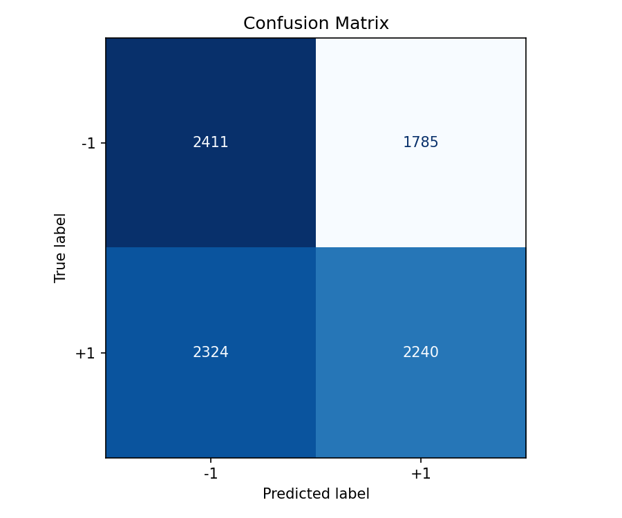

### Backtest
- Final Equity: **2.0127**
- CAGR: **1.0127**
- Volatility: **0.6174**
- Sharpe: **1.4467**
- Max Drawdown: **-0.3230**

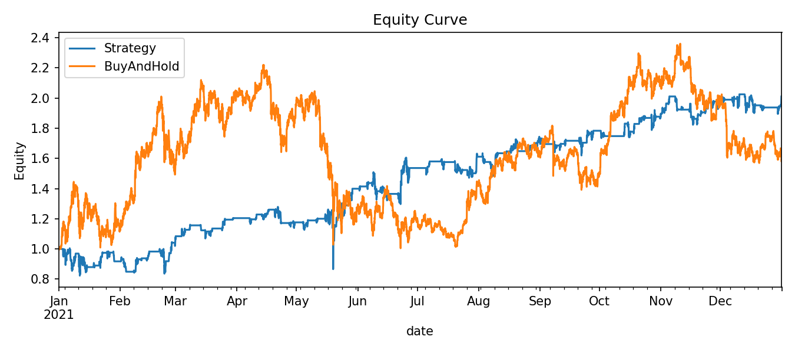

### Feature importance
- MDI leaders: `vol_12`, `rsi_14`
- PFI leader: `rsi_14`
- Cluster importance led by momentum

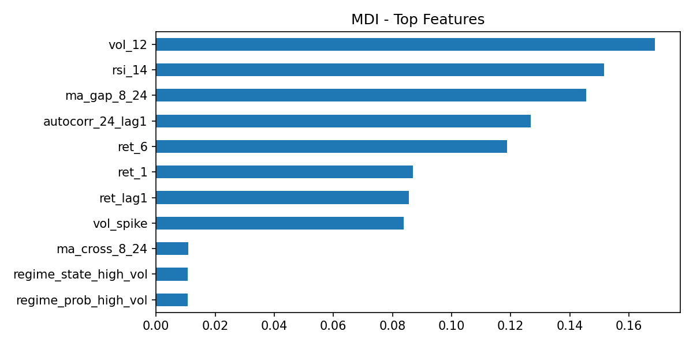
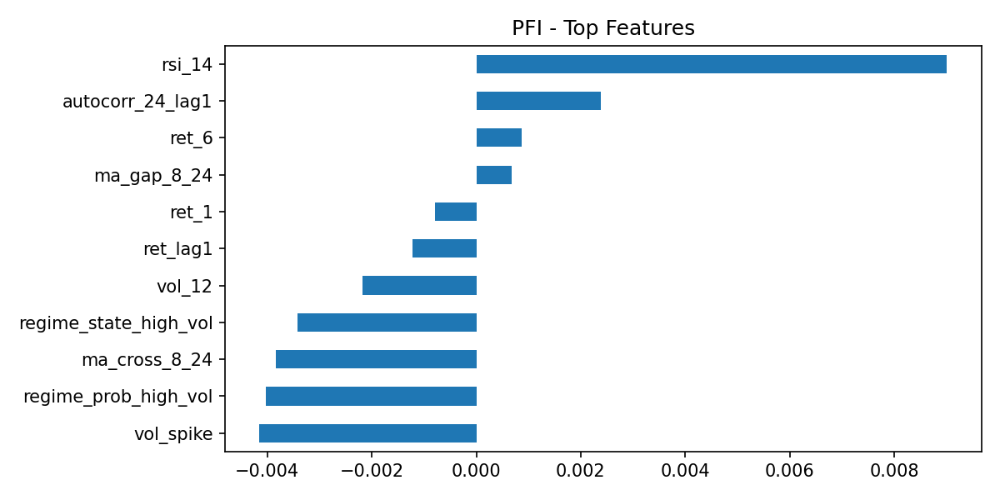

---

## 2.2 Aggressive + short not allowed

### Classification
Same classifier quality as aggressive short-allowed run.

### Backtest
- Final Equity: **2.2602**
- CAGR: **1.2602**
- Volatility: **0.5461**
- Sharpe: **1.7717**
- Max Drawdown: **-0.3410**

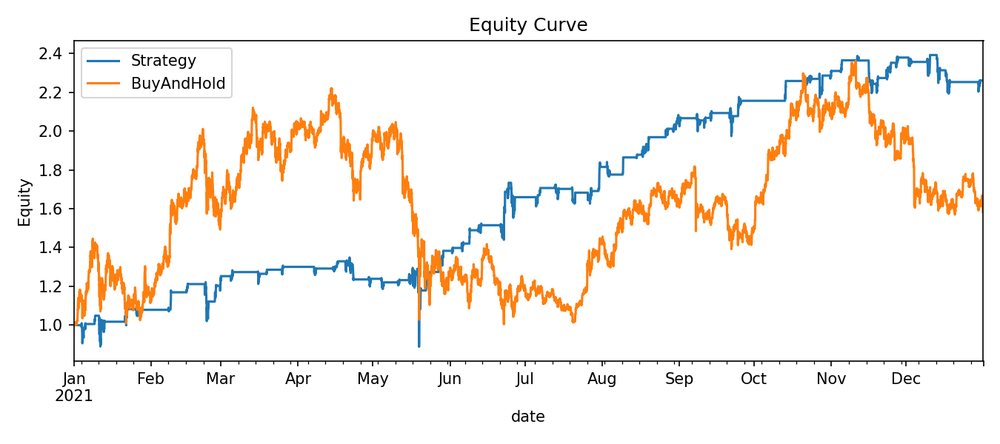

### Feature importance
Feature hierarchy is consistent with aggressive short-allowed run.

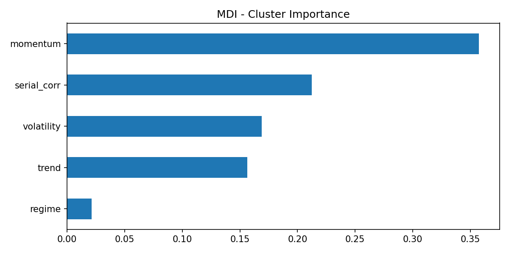
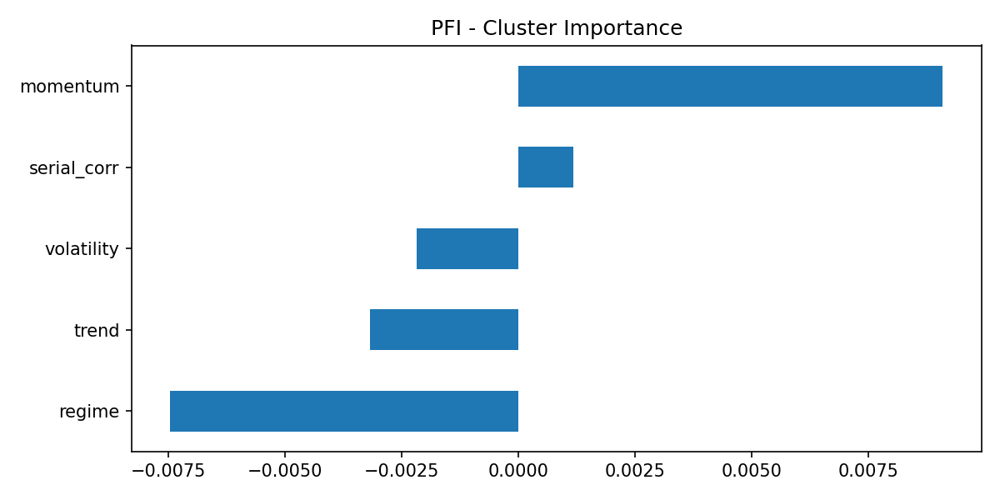

---

## 2.3 Aggressive comparison

In 2021, aggressive long-only beat aggressive short-enabled:
- higher Final Equity
- higher Sharpe
- lower volatility

Interpretation: shorting reduced upside capture in a market structure where long participation mattered more.

---

# Final conclusion

Across all four runs, we observe:

1. Classification quality stays in a narrow range (~53% macro metrics).
2. Most performance differences come from **signal mapping and short policy**, not from major classifier changes.
3. Best observed configuration: **Aggressive + short not allowed**.
4. Worst observed configuration: **SAFE + short allowed**.
5. Feature-importance patterns are stable across runs, with momentum/serial-correlation signals repeatedly useful.

So for this test year, we get better outcomes by keeping the strategy selective and limiting (or disabling) short exposure.